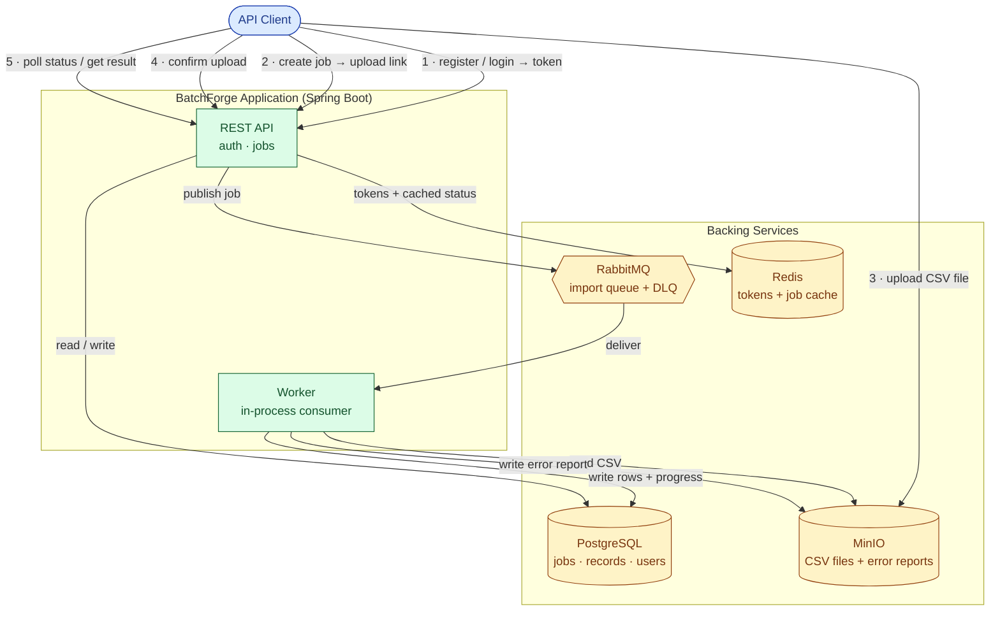

# BatchForge

BatchForge is a backend service for **importing large CSV files in the background**.

You hand it a CSV of contacts, it validates and stores every row, keeps the good rows,
records the bad ones in a downloadable error report, and lets you check progress at any
time — all without making you wait while it works. Uploads, processing, and results are
handled asynchronously, so a file with tens of thousands of rows is no problem.

Each customer (an *organization*) sees only its own data, uploads are secured with
time-limited links, and a job that gets interrupted safely resumes where it left off
without creating duplicates.

---

## How it works (high-level design)



**The lifecycle of an import, in plain terms:**

1. **Sign in.** Register an organization (the first user becomes its owner) or log in to get an access token.
2. **Create a job.** Ask for a new import job; you get back a job ID and a temporary link to upload your file.
3. **Upload.** Send your CSV straight to storage using that link.
4. **Confirm.** Tell BatchForge the file is ready; the job is queued for processing.
5. **Track & retrieve.** The worker processes the file in the background. Poll the job to watch its progress, and once it's done, fetch the result (including an error report if any rows failed validation).

---

## Tech stack

| Area | Technology |
|------|-----------|
| Language / runtime | Java 21 |
| Framework | Spring Boot 4.1 |
| Build | Maven (via the included `mvnw` wrapper) |
| Database | PostgreSQL 16 |
| Message queue | RabbitMQ 4 |
| Cache / tokens | Redis 7 |
| Object storage | MinIO (S3-compatible) |
| API docs | OpenAPI / Swagger UI |

---

## Prerequisites

- **Docker** and **Docker Compose**.
- **Java 21** and the `mvnw` wrapper — needed to build and run the app from source, or to run the test suite.

---

## Quick start

### Option A — Everything in Docker

Builds the app and starts it together with the database, queue, cache, and storage.
One command, nothing else to install beyond Docker:

```bash
docker compose up --build
```

Wait for the log line `Started BatchforgeApplication`. That's it — BatchForge is running.

| What | URL |
|------|-----|
| API base | http://localhost:8080 |
| **Swagger UI** (try the API in your browser) | http://localhost:8080/swagger-ui/index.html |
| Health check | http://localhost:8080/actuator/health |
| RabbitMQ management console | http://localhost:15672 |
| MinIO console | http://localhost:9001 |

Default username/password for the consoles is `batchforge` / `batchforge` (dev only).

To stop: `Ctrl-C`, then `docker compose down` (add `-v` to also wipe the stored data).

### Option B — Backing services in Docker, app from source (for development)

Run the backing services in Docker and the application from source. This gives you fast
restarts while developing and direct access to logs and the debugger from your IDE:

```bash
# 1. Start Postgres, RabbitMQ, Redis, MinIO (leave the "app" service out)
docker compose up -d postgres rabbitmq redis minio minio-init

# 2. Run BatchForge from source
./mvnw spring-boot:run
```

The app connects to the services on their host ports (Postgres `5434`, Redis `6380`, etc.).

---

## Trying it out

The friendliest way is **Swagger UI** (http://localhost:8080/swagger-ui/index.html) — you can
fill in and send every request from the browser. If you prefer the command line, here's the
full flow with `curl`:

```bash
# 1. Register an organization + first user (you get back an access token)
curl -s -X POST http://localhost:8080/auth/register \
  -H "Content-Type: application/json" \
  -d '{"organizationName":"Acme","email":"you@acme.com","password":"s3cret-password"}'

# Save the access token from the response, then:
TOKEN="paste-access-token-here"

# 2. Create an import job (returns a jobId and an uploadUrl)
curl -s -X POST http://localhost:8080/jobs -H "Authorization: Bearer $TOKEN"

# 3. Upload your CSV to the uploadUrl from step 2
curl -X PUT --upload-file contacts.csv "paste-uploadUrl-here"

# 4. Confirm the upload — the job is now queued for processing
curl -s -X POST http://localhost:8080/jobs/<jobId>/uploaded -H "Authorization: Bearer $TOKEN"

# 5. Check status / progress (repeat until status is COMPLETED)
curl -s http://localhost:8080/jobs/<jobId> -H "Authorization: Bearer $TOKEN"

# 6. Get the result (a download link for the error report, if any rows failed)
curl -s http://localhost:8080/jobs/<jobId>/result -H "Authorization: Bearer $TOKEN"
```

### CSV format

BatchForge imports **contacts**. Your file must have this header row:

```csv
email,first_name,last_name,phone
alice@example.com,Alice,Anderson,+1-555-0100
bob@example.com,Bob,Brown,
```

- `email` — required, must be a valid email address
- `first_name` — required
- `last_name` — required
- `phone` — optional

Rows that fail these rules are skipped, counted as failures, and listed in the downloadable
error report; valid rows are imported. A job with some bad rows still completes successfully.

---

## Configuration

Every setting ships with a working default for local use, so no configuration is needed to
run BatchForge on your machine. For any real deployment, supply your own credentials and
secrets through environment variables. The full list of variables — covering the database,
message queue, cache, object storage, and the JWT signing secret — is documented in
[`.env.example`](.env.example).

**Profiles:** the app runs in a permissive **dev** mode by default (Swagger UI on, full
health/metrics endpoints). Set `SPRING_PROFILES_ACTIVE=prod` to harden it for production —
API docs are disabled and only the health endpoint is exposed.

---

## Running the tests

The test suite runs the application against **real** Postgres, Redis, and MinIO instances.
It uses Testcontainers, which starts these dependencies automatically in throwaway
containers for the duration of the run — you do **not** need to start the compose stack
yourself.

1. Make sure Docker is running (Docker Desktop open, or the Docker daemon started).
2. Run the suite:

```bash
./mvnw test
```

Testcontainers will spin up the databases it needs, run all tests against them, and tear
them down when finished.

After the run, a code-coverage report is generated at:

```
target/site/jacoco/index.html
```

The build enforces a minimum line-coverage threshold, so a drop in coverage fails the build.

---

## Project layout

```
batchforge/
├── src/main/java/com/batchforge/
│   ├── auth/           # registration, login, JWT, security
│   ├── job/            # jobs, CSV parsing, the worker, caching
│   ├── storage/        # MinIO integration (presigned URLs, uploads)
│   ├── organization/   # organizations (tenants)
│   ├── user/           # users & roles
│   ├── ratelimit/      # request rate limiting
│   ├── observability/  # correlation-ID logging
│   └── common/         # shared error handling
├── src/main/resources/
│   ├── application.yml         # base (dev) configuration
│   ├── application-prod.yml    # production overrides
│   └── db/migration/           # Flyway database migrations
├── Dockerfile
├── docker-compose.yml
└── .env.example
```

---

## Troubleshooting

- **`docker compose up` fails immediately** — make sure Docker Desktop (or your Docker daemon) is actually running.
- **Port already in use** — BatchForge uses `8080` (app), `5434` (Postgres), `6380` (Redis), `5672`/`15672` (RabbitMQ), `9000`/`9001` (MinIO). Stop whatever else is using those ports, or change the mappings in `docker-compose.yml`.
- **Running from source and it can't connect** — start the backing services first (Option B, step 1); the app expects them on their host ports.
- **`./mvnw test` fails to start containers** — Docker isn't running, or your machine can't pull the test images. Confirm `docker ps` works.